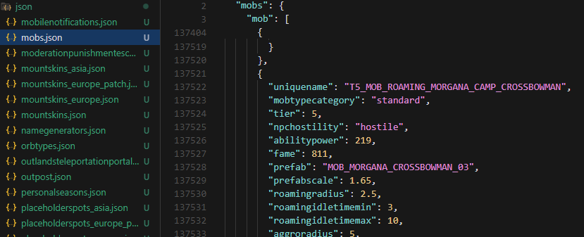

# A.O. Noki - Albion Online Dumped Files

🌐 Languages:
- [Português](README.md) 🇧🇷
- [English](README.en.md) 🇺🇸
- [Español](README.es.md) 🇪🇸

## About the Project

A.O. Noki Dumped Files is a repository dedicated to providing updated dumps from the Albion Online client. Unlike other similar repositories, our focus is on the general data structure, using machine learning to consolidate extractions and offer relevant data in XML and JSON formats, while providing detailed extraction logs for complete transparency.

## Objective

The main objective of this project is to assist developers and content creators who wish to:

- Develop tools and applications for Albion Online
- Use services like [Albion Render Service](https://wiki.albiononline.com/wiki/API:Render_service) to extract game images
- Create APIs with accurate and updated IDs
- Access structured data from the current game client

## Features

- Updated dumps after each game patch
- Data available in XML and JSON
- Detailed validation logs
- Organized structure by categories
- Compatibility with Albion Render Service
- Documentation of changes between versions

## Data Structure

The repository contains various files organized in categories such as:

- Items and Equipment
- Characters and Avatars
- Buildings and Structures
- Mobs and NPCs
- Resources and Harvestables
- Localizations
- Wardrobe and Cosmetics

## Usage

The data can be used for:

1. Third-party tool development
2. Website and application creation
3. Game data analysis
4. Integration with existing APIs
5. Game studies and research

## Important Notes

- This is an unofficial project
- All game rights belong to Sandbox Interactive GmbH
- The project aims only to assist the developer community
- It has no functionality that alters the game client

## Related Tools

- [AO-Noki-Bin-Dumpper](https://github.com/AO-Noki/noki-bin-dumpper)
- [Albion Online Data Project](https://www.albion-online-data.com/)
- [Albion Online API](https://wiki.albiononline.com/wiki/API_and_Client)

## Contributing

Contributions are welcome! If you find issues or have suggestions, feel free to:

1. Open an Issue
2. Submit a Pull Request
3. Contact the maintainers

## License

This project is distributed under the MIT license. See the `LICENSE` file for more details.

## Disclaimer

This project has no official affiliation with Albion Online or Sandbox Interactive GmbH. It is a community initiative to assist developers and players.

---

Maintained by A.O. Noki with ❤️ for the Albion Online community.