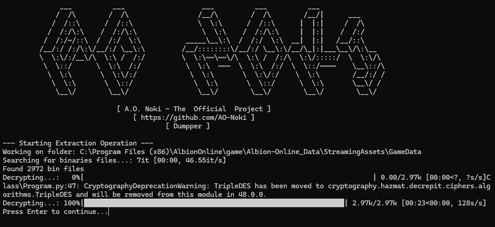

# A.O. Noki - Albion Online Dumped Files

🌐 Idiomas:
- [Português](README.md) 🇧🇷
- [English](README.en.md) 🇺🇸
- [Español](README.es.md) 🇪🇸

## Sobre el Proyecto

A.O. Noki Dumped Files es un repositorio dedicado a proporcionar dumps actualizados del cliente de Albion Online. A diferencia de otros repositorios similares, nuestro enfoque está en la estructura general de los datos, utilizando machine learning para consolidar las extracciones y ofrecer datos relevantes en formatos XML y JSON, además de proporcionar registros detallados del proceso de extracción para total transparencia.

## Objetivo

El objetivo principal de este proyecto es ayudar a desarrolladores y creadores de contenido que desean:

- Desarrollar herramientas y aplicaciones para Albion Online
- Utilizar servicios como [Albion Render Service](https://wiki.albiononline.com/wiki/API:Render_service) para extraer imágenes del juego
- Crear APIs con IDs precisos y actualizados
- Acceder a datos estructurados del cliente actual del juego

## Características

- Dumps actualizados después de cada parche del juego
- Datos disponibles en XML y JSON
- Registros detallados de validación
- Estructura organizada por categorías
- Compatibilidad con Albion Render Service
- Documentación de cambios entre versiones

## Estructura de Datos

El repositorio contiene varios archivos organizados en categorías como:

- Items y Equipamiento
- Personajes y Avatares
- Edificios y Estructuras
- Mobs y NPCs
- Recursos y Recolectables
- Localizaciones
- Vestuario y Cosméticos

## Uso

Los datos pueden ser utilizados para:

1. Desarrollo de herramientas third-party
2. Creación de sitios web y aplicaciones
3. Análisis de datos del juego
4. Integración con APIs existentes
5. Estudios e investigaciones sobre el juego

## Notas Importantes

- Este es un proyecto no oficial
- Todos los derechos del juego pertenecen a Sandbox Interactive GmbH
- El proyecto busca solo ayudar a la comunidad de desarrolladores
- No posee ninguna funcionalidad que altere el cliente del juego

## Herramientas Relacionadas

- [AO-Noki-Bin-Dumpper](https://github.com/AO-Noki/noki-bin-dumpper)
- [Albion Online Data Project](https://www.albion-online-data.com/)
- [Albion Online API](https://wiki.albiononline.com/wiki/API_and_Client)

## Contribución

¡Las contribuciones son bienvenidas! Si encuentras problemas o tienes sugerencias, siéntete libre de:

1. Abrir un Issue
2. Enviar un Pull Request
3. Contactar a los mantenedores

## Licencia

Este proyecto se distribuye bajo la licencia MIT. Consulta el archivo `LICENSE` para más detalles.

## Disclaimer

Este proyecto no tiene afiliación oficial con Albion Online o Sandbox Interactive GmbH. Es una iniciativa de la comunidad para ayudar a desarrolladores y jugadores.

## Gracias

Agradezco a los mantenedores de [AoData](https://github.com/ao-data) por la documentación y los datos utilizados como base para crear este proyecto.

---

Mantenido por A.O. Noki con ❤️ para la comunidad de Albion Online. 